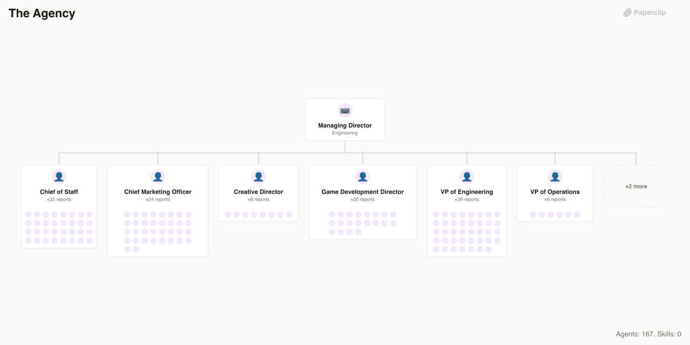

# Agency Agents

> A complete AI agency with 167 specialized agents across 10 divisions — engineering, design, marketing, product, sales, QA, operations, game development, spatial computing, and specialized operations

> An [Agent Company](https://agentcompanies.io) based on [Agency Agents](https://github.com/msitarzewski/agency-agents) — a large library of specialized agent role definitions for a multi-division AI agency



## What's Inside

> This is an [Agent Company](https://agentcompanies.io) package from [Paperclip](https://paperclip.ing)

| Content | Count |
|---------|-------|
| Agents | 167 |

### Agents

| Agent | Role | Reports To |
|-------|------|------------|
| Anthropologist | Engineer | chief-of-staff |
| Geographer | Engineer | chief-of-staff |
| Historian | Engineer | chief-of-staff |
| Narratologist | Engineer | chief-of-staff |
| Psychologist | Engineer | chief-of-staff |
| Accounts Payable Agent | Engineer | chief-of-staff |
| Agentic Identity & Trust Architect | Engineer | chief-of-staff |
| Agents Orchestrator | Engineer | chief-of-staff |
| Automation Governance Architect | Engineer | chief-of-staff |
| Blender Add-on Engineer | Engineer | game-dev-director |
| Blockchain Security Auditor | Engineer | chief-of-staff |
| Chief of Staff | Engineer | ceo |
| Chief Marketing Officer | CMO | ceo |
| Compliance Auditor | Engineer | chief-of-staff |
| Corporate Training Designer | Engineer | chief-of-staff |
| Creative Director | Engineer | ceo |
| Data Consolidation Agent | Engineer | chief-of-staff |
| Brand Guardian | Engineer | creative-director |
| Image Prompt Engineer | Engineer | creative-director |
| Inclusive Visuals Specialist | Engineer | creative-director |
| UI Designer | Engineer | creative-director |
| UX Architect | Engineer | creative-director |
| UX Researcher | Engineer | creative-director |
| Visual Storyteller | Engineer | creative-director |
| Whimsy Injector | Engineer | creative-director |
| AI Data Remediation Engineer | Engineer | vp-engineering |
| AI Engineer | Engineer | vp-engineering |
| Autonomous Optimization Architect | Engineer | vp-engineering |
| Backend Architect | Engineer | vp-engineering |
| Code Reviewer | Engineer | vp-engineering |
| Data Engineer | Engineer | vp-engineering |
| Database Optimizer | Engineer | vp-engineering |
| DevOps Automator | Engineer | vp-engineering |
| Embedded Firmware Engineer | Engineer | vp-engineering |
| Feishu Integration Developer | Engineer | vp-engineering |
| Frontend Developer | Engineer | vp-engineering |
| Git Workflow Master | Engineer | vp-engineering |
| Incident Response Commander | Engineer | vp-engineering |
| Mobile App Builder | Engineer | vp-engineering |
| Rapid Prototyper | Engineer | vp-engineering |
| Security Engineer | Engineer | vp-engineering |
| Senior Developer | Engineer | vp-engineering |
| Software Architect | Engineer | vp-engineering |
| Solidity Smart Contract Engineer | Engineer | vp-engineering |
| SRE (Site Reliability Engineer) | Engineer | vp-engineering |
| Technical Writer | Engineer | vp-engineering |
| Threat Detection Engineer | Engineer | vp-engineering |
| WeChat Mini Program Developer | Engineer | vp-engineering |
| Game Audio Engineer | Engineer | game-dev-director |
| Game Designer | Engineer | game-dev-director |
| Game Development Director | Engineer | ceo |
| Godot Gameplay Scripter | Engineer | game-dev-director |
| Godot Multiplayer Engineer | Engineer | game-dev-director |
| Godot Shader Developer | Engineer | game-dev-director |
| Government Digital Presales Consultant | Engineer | chief-of-staff |
| Healthcare Marketing Compliance Specialist | Engineer | chief-of-staff |
| Identity Graph Operator | Engineer | chief-of-staff |
| Level Designer | Engineer | game-dev-director |
| LSP/Index Engineer | Engineer | chief-of-staff |
| macOS Spatial/Metal Engineer | Engineer | xr-director |
| CEO | Engineer | — |
| AI Citation Strategist | Engineer | cmo |
| App Store Optimizer | Engineer | cmo |
| Baidu SEO Specialist | Engineer | cmo |
| Bilibili Content Strategist | Engineer | cmo |
| Book Co-Author | Engineer | cmo |
| Carousel Growth Engine | Engineer | cmo |
| China E-Commerce Operator | Engineer | cmo |
| Content Creator | Engineer | cmo |
| Cross-Border E-Commerce Specialist | Engineer | cmo |
| Douyin Strategist | Engineer | cmo |
| Growth Hacker | Engineer | cmo |
| Instagram Curator | Engineer | cmo |
| Kuaishou Strategist | Engineer | cmo |
| LinkedIn Content Creator | Engineer | cmo |
| Livestream Commerce Coach | Engineer | cmo |
| Podcast Strategist | Engineer | cmo |
| Private Domain Operator | Engineer | cmo |
| Reddit Community Builder | Engineer | cmo |
| SEO Specialist | Engineer | cmo |
| Short-Video Editing Coach | Engineer | cmo |
| Social Media Strategist | Engineer | cmo |
| TikTok Strategist | Engineer | cmo |
| Twitter Engager | Engineer | cmo |
| WeChat Official Account Manager | Manager | cmo |
| Weibo Strategist | Engineer | cmo |
| Xiaohongshu Specialist | Engineer | cmo |
| Zhihu Strategist | Engineer | cmo |
| Narrative Designer | Engineer | game-dev-director |
| Paid Media Auditor | Engineer | cmo |
| Ad Creative Strategist | Engineer | cmo |
| Paid Social Strategist | Engineer | cmo |
| PPC Campaign Strategist | Engineer | cmo |
| Programmatic & Display Buyer | Engineer | cmo |
| Search Query Analyst | Engineer | cmo |
| Tracking & Measurement Specialist | Engineer | cmo |
| Behavioral Nudge Engine | Engineer | vp-product |
| Feedback Synthesizer | Engineer | vp-product |
| Product Manager | Manager | vp-product |
| Sprint Prioritizer | Engineer | vp-product |
| Trend Researcher | Engineer | vp-product |
| Experiment Tracker | Engineer | vp-product |
| Jira Workflow Steward | Engineer | vp-product |
| Project Shepherd | Engineer | vp-product |
| Studio Operations | Engineer | vp-product |
| Studio Producer | Engineer | vp-product |
| Senior Project Manager | Manager | vp-product |
| QA Director | Engineer | vp-engineering |
| Recruitment Specialist | Engineer | chief-of-staff |
| Report Distribution Agent | Engineer | chief-of-staff |
| Roblox Avatar Creator | Engineer | game-dev-director |
| Roblox Experience Designer | Engineer | game-dev-director |
| Roblox Systems Scripter | Engineer | game-dev-director |
| Account Strategist | Engineer | vp-sales |
| Sales Coach | Engineer | vp-sales |
| Sales Data Extraction Agent | Engineer | chief-of-staff |
| Deal Strategist | Engineer | vp-sales |
| Discovery Coach | Engineer | vp-sales |
| Sales Engineer | Engineer | vp-sales |
| Outbound Strategist | Engineer | vp-sales |
| Pipeline Analyst | Engineer | vp-sales |
| Proposal Strategist | Engineer | vp-sales |
| Cultural Intelligence Strategist | Engineer | chief-of-staff |
| Developer Advocate | Engineer | chief-of-staff |
| Document Generator | Engineer | chief-of-staff |
| French Consulting Market Navigator | Engineer | chief-of-staff |
| Korean Business Navigator | Engineer | chief-of-staff |
| MCP Builder | Engineer | chief-of-staff |
| Model QA Specialist | Engineer | chief-of-staff |
| Salesforce Architect | Engineer | chief-of-staff |
| Workflow Architect | Engineer | chief-of-staff |
| Study Abroad Advisor | Engineer | chief-of-staff |
| Supply Chain Strategist | Engineer | chief-of-staff |
| Analytics Reporter | Engineer | vp-operations |
| Executive Summary Generator | Engineer | vp-operations |
| Finance Tracker | Engineer | vp-operations |
| Infrastructure Maintainer | Engineer | vp-operations |
| Legal Compliance Checker | Engineer | vp-operations |
| Support Responder | Engineer | vp-operations |
| Technical Artist | Engineer | game-dev-director |
| Terminal Integration Specialist | Engineer | xr-director |
| Accessibility Auditor | Engineer | qa-director |
| API Tester | Engineer | qa-director |
| Evidence Collector | Engineer | qa-director |
| Performance Benchmarker | Engineer | qa-director |
| Reality Checker | Engineer | qa-director |
| Test Results Analyzer | Engineer | qa-director |
| Tool Evaluator | Engineer | qa-director |
| Workflow Optimizer | Engineer | qa-director |
| Unity Architect | Engineer | game-dev-director |
| Unity Editor Tool Developer | Engineer | game-dev-director |
| Unity Multiplayer Engineer | Engineer | game-dev-director |
| Unity Shader Graph Artist | Engineer | game-dev-director |
| Unreal Multiplayer Architect | Engineer | game-dev-director |
| Unreal Systems Engineer | Engineer | game-dev-director |
| Unreal Technical Artist | Engineer | game-dev-director |
| Unreal World Builder | Engineer | game-dev-director |
| visionOS Spatial Engineer | Engineer | xr-director |
| VP of Engineering | VP | ceo |
| VP of Operations | VP | ceo |
| VP of Product | VP | ceo |
| VP of Sales | VP | ceo |
| XR Cockpit Interaction Specialist | Engineer | xr-director |
| XR Director | Engineer | vp-engineering |
| XR Immersive Developer | Engineer | xr-director |
| XR Interface Architect | Engineer | xr-director |
| ZK Steward | Engineer | chief-of-staff |

## Getting Started

```bash
npx paperclipai company import this-github-url-or-folder
```

See [Paperclip](https://paperclip.ing) for more information.

---
Exported from [Paperclip](https://paperclip.ing) on 2026-03-23
