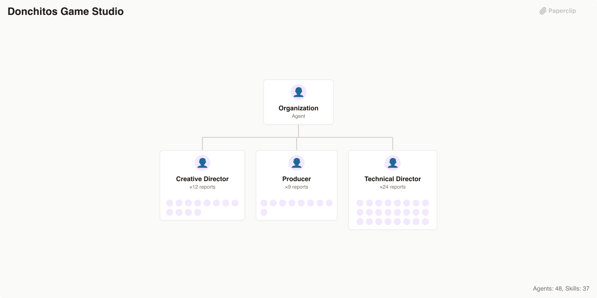

# 🏢 Paperclip Companies

> **Deploy an entire AI workforce in minutes** — 16 pre-built companies, 440+ specialized agents, and 500+ battle-tested skills. From security auditors to game studios, from scientific research labs to full-stack dev shops. Plug in, power up, ship.

[](https://github.com/paperclipai/companies)
[](https://opensource.org/licenses/MIT)
[](https://makeapullrequest.com)
[](https://github.com/paperclipai/paperclip)

---

## 🚀 What Is This?

A growing catalog of ready-to-deploy agent companies for the [Paperclip](https://github.com/paperclipai/paperclip) platform. Each company is a fully configured team of AI agents — org chart, skills, governance — that you can import and run immediately.

- **🎯 Domain-Specific**: Security firms, game studios, science labs, consultancies — not generic prompt wrappers
- **🧬 Complete Org Structures**: CEO → directors → specialists, with real reporting lines and delegation
- **🛠️ Skill-Loaded**: Hundreds of reusable workflow skills agents actually know how to run
- **⚡ Import & Go**: `npx paperclipai company import --from ./trail-of-bits-security` and you're live

## Table of Contents

| Company                                                   | Agents | Skills | Source                                                                             |
| --------------------------------------------------------- | ------ | ------ | ---------------------------------------------------------------------------------- |
| [GStack](#gstack)                                         | 5      | 27     | [gstack](https://github.com/garrytan/gstack/tree/main)                             |
| [Superpowers Dev Shop](#superpowers-dev-shop)             | 4      | 14     | [superpowers](https://github.com/obra/superpowers)                                 |
| [Agency Agents](#agency-agents)                           | 167    | —      | [agency-agents](https://github.com/msitarzewski/agency-agents)                     |
| [Aeon Intelligence](#aeon-intelligence)                   | 4      | 32     | [Aeon](https://github.com/aaronjmars/aeon)                                         |
| [AgentSys Engineering](#agentsys-engineering)             | 5      | 14     | [agentsys](https://github.com/agent-sh/agentsys)                                   |
| [ClawTeam Capital](#clawteam-capital)                     | 7      | 1      | [ClawTeam](https://github.com/HKUDS/ClawTeam)                                      |
| [ClawTeam Engineering](#clawteam-engineering)             | 5      | 1      | [ClawTeam](https://github.com/HKUDS/ClawTeam)                                      |
| [ClawTeam Research Lab](#clawteam-research-lab)           | 4      | 1      | [ClawTeam](https://github.com/HKUDS/ClawTeam)                                      |
| [Donchitos Game Studio](#donchitos-game-studio)           | 48     | 38     | [Claude-Code-Game-Studios](https://github.com/Donchitos/Claude-Code-Game-Studios)  |
| [Fullstack Forge](#fullstack-forge)                       | 49     | 66     | [claude-skills](https://github.com/jeffallan/claude-skills)                        |
| [K-Dense Science Lab](#k-dense-science-lab)               | 54     | 177    | [claude-scientific-skills](https://github.com/K-Dense-AI/claude-scientific-skills) |
| [MiniMax Studio](#minimax-studio)                         | 5      | 10     | [MiniMax-AI/skills](https://github.com/MiniMax-AI/skills)                          |
| [Product Compass Consulting](#product-compass-consulting) | 48     | 65     | [pm-skills](https://github.com/phuryn/pm-skills)                                   |
| [RedOak Review](#redoak-review)                           | 5      | 6      | [claude-code-workflows](https://github.com/OneRedOak/claude-code-workflows)        |
| [TÂCHES Creative](#tâches-creative)                       | 6      | 35     | [taches-cc-resources](https://github.com/glittercowboy/taches-cc-resources)        |
| [Trail of Bits Security](#trail-of-bits-security)         | 28     | 35     | [skills](https://github.com/trailofbits/skills)                                    |

## Companies

### [GStack](./gstack)

```bash
npx companies.sh add paperclipai/companies/gstack
```

Engineering company powered by gstack workflow skills — distinct cognitive modes for product vision, design critique, technical planning, security auditing, code review, shipping, deployment, and QA. Built from [gstack](https://github.com/garrytan/gstack/tree/main).


> **Agents (5):** Ceo, Cto, Qa Engineer, Release Engineer, Staff Engineer
>
> **Skills (27):** autoplan, benchmark, browse, canary, careful, codex, cso, design-consultation, design-review, document-release, freeze, gstack-upgrade, guard, investigate, land-and-deploy, office-hours, plan-ceo-review, plan-design-review, plan-eng-review, qa, qa-only, retro, review, setup-browser-cookies, setup-deploy, ship, unfreeze

### [Superpowers Dev Shop](./superpowers)

```bash
npx companies.sh add paperclipai/companies/superpowers
```

A disciplined software development company powered by the Superpowers workflow — brainstorm, plan, build with TDD, review, and ship. Built from [superpowers](https://github.com/obra/superpowers).


> **Agents (4):** Ceo, Code Reviewer, Lead Engineer, Release Engineer
>
> **Skills (14):** brainstorming, dispatching-parallel-agents, executing-plans, finishing-a-development-branch, receiving-code-review, requesting-code-review, subagent-driven-development, systematic-debugging, test-driven-development, using-git-worktrees, using-superpowers, verification-before-completion, writing-plans, writing-skills

### [Agency Agents](./agency-agents)

```bash
npx companies.sh add paperclipai/companies/agency-agents
```

A complete AI agency with 167 specialized agents across 10 divisions — engineering, design, marketing, product, sales, QA, operations, game development, spatial computing, and specialized operations. Built from [agency-agents](https://github.com/msitarzewski/agency-agents).


> **Agents (167):** Academic Anthropologist, Academic Geographer, Academic Historian, Academic Narratologist, Academic Psychologist, Accounts Payable Agent, Agentic Identity Trust, Agents Orchestrator, Automation Governance Architect, Blender Addon Engineer, Blockchain Security Auditor, Chief of Staff, Cmo, Compliance Auditor, Corporate Training Designer, Creative Director, Data Consolidation Agent, Design Brand Guardian, Design Image Prompt Engineer, Design Inclusive Visuals Specialist, Design Ui Designer, Design Ux Architect, Design Ux Researcher, Design Visual Storyteller, Design Whimsy Injector, and 142 more

### [Aeon Intelligence](./aeon-intelligence)

```bash
npx companies.sh add paperclipai/companies/aeon-intelligence
```

Autonomous AI intelligence company powered by Aeon — runs research, engineering, crypto monitoring, and productivity workflows on GitHub Actions via Claude Code. Built from [Aeon](https://github.com/aaronjmars/aeon).


> **Agents (4):** Cio, Crypto Analyst, Engineering Lead, Research Analyst
>
> **Skills (32):** morning-brief, weekly-review, goal-tracker, digest, idea-capture, heartbeat, memory-flush, reflect, skill-health, self-review, article, research-brief, paper-digest, hacker-news-digest, rss-digest, reddit-digest, security-digest, tweet-digest, fetch-tweets, search-papers, pr-review, github-monitor, issue-triage, changelog, code-health, and 7 more

### [AgentSys Engineering](./agentsys-engineering)

```bash
npx companies.sh add paperclipai/companies/agentsys-engineering
```

AI-powered software engineering company that orchestrates the full development lifecycle — from task discovery through production shipping. Built from [agentsys](https://github.com/agent-sh/agentsys).


> **Agents (5):** Ceo, Cto, Qa Release Lead, Research Perf Analyst, Staff Engineer
>
> **Skills (14):** consult, debate, deslop, discover-tasks, drift-analysis, enhance-orchestrator, enhance-prompts, learn, orchestrate-review, perf-analyzer, perf-benchmarker, repo-intel, sync-docs, validate-delivery

### [ClawTeam Capital](./clawteam-capital)

```bash
npx companies.sh add paperclipai/companies/clawteam-capital
```

AI-powered investment analysis through specialized multi-agent teams that research securities from multiple angles and consolidate signals into risk-adjusted portfolio decisions. Built from [ClawTeam](https://github.com/HKUDS/ClawTeam).


> **Agents (7):** Buffett Analyst, Fundamentals Analyst, Growth Analyst, Portfolio Manager, Risk Manager, Sentiment Analyst, Technical Analyst
>
> **Skills (1):** clawteam

### [ClawTeam Engineering](./clawteam-engineering)

```bash
npx companies.sh add paperclipai/companies/clawteam-engineering
```

Agentic software engineering through self-organizing multi-agent teams that plan, build, review, test, and deploy software autonomously. Built from [ClawTeam](https://github.com/HKUDS/ClawTeam).


> **Agents (5):** Backend Developer, Devops Engineer, Frontend Developer, Qa Engineer, Tech Lead
>
> **Skills (1):** clawteam

### [ClawTeam Research Lab](./clawteam-research-lab)

```bash
npx companies.sh add paperclipai/companies/clawteam-research-lab
```

Autonomous ML research automation through coordinated multi-agent teams that conduct literature surveys, design experiments, run analyses, and synthesize findings. Built from [ClawTeam](https://github.com/HKUDS/ClawTeam).


> **Agents (4):** Data Analyst, Literature Surveyor, Methodology Designer, Principal Investigator
>
> **Skills (1):** clawteam

### [Donchitos Game Studio](./donchitos-game-studio)

```bash
npx companies.sh add paperclipai/companies/donchitos-game-studio
```

Full-service indie game development studio with 48 coordinated AI agents spanning creative direction, engineering, design, art, audio, narrative, QA, and production. Built from [Claude-Code-Game-Studios](https://github.com/Donchitos/Claude-Code-Game-Studios).



> **Agents (48):** Accessibility Specialist, Ai Programmer, Analytics Engineer, Art Director, Audio Director, Community Manager, Creative Director, Devops Engineer, Economy Designer, Engine Programmer, Game Designer, Gameplay Programmer, Godot Gdextension Specialist, Godot Gdscript Specialist, Godot Shader Specialist, Godot Specialist, Lead Programmer, Level Designer, Live Ops Designer, Localization Lead, Narrative Director, Network Programmer, Performance Analyst, Producer, Prototyper, and 23 more
>
> **Skills (38):** architecture-decision, asset-audit, balance-check, brainstorm, bug-report, changelog, code-review, design-review, design-system, estimate, gate-check, hotfix, launch-checklist, localize, map-systems, milestone-review, onboard, patch-notes, perf-profile, playtest-report, project-stage-detect, prototype, release-checklist, retrospective, reverse-document, and 13 more

### [Fullstack Forge](./fullstack-forge)

```bash
npx companies.sh add paperclipai/companies/fullstack-forge
```

A full-service software development consultancy with 66 specialized skills covering 12 programming languages, 7 backend frameworks, frontend/mobile, infrastructure, security, data science, and DevOps. Built from [claude-skills](https://github.com/jeffallan/claude-skills).


> **Agents (49):** Ai Engineer, Angular Engineer, Api Engineer, Architecture Lead, Atlassian Engineer, Backend Lead, Ceo, Cloud Engineer, Code Quality Specialist, Cto, Data Engineer, Data Lead, Database Engineer, Devops Engineer, Devops Lead, Distributed Systems Engineer, Ecommerce Engineer, Embedded Systems Engineer, Enterprise Backend Engineer, Frontend Lead, Game Developer, Go Engineer, Infrastructure Lead, Jvm Engineer, Kubernetes Engineer, and 24 more
>
> **Skills (66):** angular-architect, api-designer, architecture-designer, atlassian-mcp, chaos-engineer, cli-developer, cloud-architect, code-documenter, code-reviewer, cpp-pro, csharp-developer, database-optimizer, debugging-wizard, devops-engineer, django-expert, dotnet-core-expert, embedded-systems, fastapi-expert, feature-forge, fine-tuning-expert, flutter-expert, fullstack-guardian, game-developer, golang-pro, graphql-architect, and 41 more

### [K-Dense Science Lab](./kdense-science-lab)

```bash
npx companies.sh add paperclipai/companies/kdense-science-lab
```

A multi-disciplinary scientific research institute powered by 177 specialized skills spanning bioinformatics, drug discovery, clinical research, machine learning, quantum computing, and 37 scientific databases. Built from [claude-scientific-skills](https://github.com/K-Dense-AI/claude-scientific-skills).


> **Agents (54):** Bio Genomics Lead, Biochemistry Specialist, Biomedical Db Specialist, Ceo, Cheminformatics Scientist, Chemistry Db Specialist, Chief Science Officer, Clinical Data Scientist, Clinical Research Lead, Clinical Trials Specialist, Computational Physicist, Critical Analysis Specialist, Data Viz Lead, Databases Lead, Deep Learning Engineer, Document Specialist, Drug Discovery Lead, Drug Screening Analyst, Financial Research Lead, Forecasting Analyst, Genomics Analyst, Genomics Db Specialist, Geospatial Analyst, Histopathology Analyst, Hypothesis Engineer, and 29 more
>
> **Skills (177):** adaptyv, aeon, alpha-vantage, alphafold-database, anndata, arboreto, arxiv-database, astropy, benchling-integration, bgpt-paper-search, bindingdb-database, biopython, biorxiv-database, bioservices, brenda-database, cbioportal-database, cellxgene-census, chembl-database, cirq, citation-management, clinical-decision-support, clinical-reports, clinicaltrials-database, clinpgx-database, clinvar-database, and 152 more

### [MiniMax Studio](./minimax-studio)

```bash
npx companies.sh add paperclipai/companies/minimax-studio
```

Full-service digital studio that builds apps, creates visual effects, and produces professional documents. Built from [MiniMax-AI/skills](https://github.com/MiniMax-AI/skills).


> **Agents (5):** App Engineer, Ceo, Document Producer, Graphics Engineer, Mobile Engineer
>
> **Skills (10):** android-native-dev, frontend-dev, fullstack-dev, gif-sticker-maker, ios-application-dev, minimax-docx, minimax-pdf, minimax-xlsx, pptx-generator, shader-dev

### [Product Compass Consulting](./product-compass-consulting)

```bash
npx companies.sh add paperclipai/companies/product-compass-consulting
```

Full-service AI product management consultancy with 65 specialized skills covering discovery, strategy, execution, research, analytics, go-to-market, marketing, and PM career tools. Built from [pm-skills](https://github.com/phuryn/pm-skills).


> **Agents (48):** Assumption Analyst, Battlecard Writer, Brand Specialist, Business Model Analyst, Career Specialist, Competitive Analyst, Competitive Intel Analyst, Cpo, Data Generator, Director Data Analytics, Director Gtm, Director Market Research, Director Marketing, Director Toolkit, Editor, Experiment Designer, Experimentation Analyst, Feature Analyst, Growth Strategist, Gtm Strategist, Ideation Specialist, Journey Mapper, Legal Specialist, Market Sizing Analyst, Marketing Strategist, and 23 more
>
> **Skills (65):** ab-test-analysis, analyze-feature-requests, ansoff-matrix, beachhead-segment, brainstorm-experiments-existing, brainstorm-experiments-new, brainstorm-ideas-existing, brainstorm-ideas-new, brainstorm-okrs, business-model, cohort-analysis, competitive-battlecard, competitor-analysis, create-prd, customer-journey-map, draft-nda, dummy-dataset, grammar-check, growth-loops, gtm-motions, gtm-strategy, ideal-customer-profile, identify-assumptions-existing, identify-assumptions-new, interview-script, and 40 more

### [RedOak Review](./redoak-review)

```bash
npx companies.sh add paperclipai/companies/redoak-review
```

A boutique code quality, design, and security review agency powered by pragmatic, opinionated review workflows. Built from [claude-code-workflows](https://github.com/OneRedOak/claude-code-workflows).


> **Agents (5):** Ceo, Ci Integration Engineer, Code Reviewer, Design Reviewer, Security Reviewer
>
> **Skills (6):** code-review-action, design-review, design-review-action, pragmatic-code-review, security-review, security-review-action

### [TÂCHES Creative](./taches-creative)

```bash
npx companies.sh add paperclipai/companies/taches-creative
```

A creative strategy and meta-skills agency specializing in thinking frameworks, research methodology, and AI workflow optimization. Built from [taches-cc-resources](https://github.com/glittercowboy/taches-cc-resources).


> **Agents (6):** Ceo, Quality Auditor, Research Lead, Skills Architect, Strategy Director, Workflow Designer
>
> **Skills (35):** consider-10-10-10, consider-5-whys, consider-eisenhower-matrix, consider-first-principles, consider-inversion, consider-occams-razor, consider-one-thing, consider-opportunity-cost, consider-pareto, consider-second-order, consider-swot, consider-via-negativa, context-handoff, create-agent-skills, create-hooks, create-mcp-servers, create-meta-prompts, create-plans, create-slash-commands, create-subagents, debug-like-expert, iphone-apps-expertise, macos-apps-expertise, meta-prompting, n8n-automations-expertise, and 10 more

### [Trail of Bits Security](./trail-of-bits-security)

```bash
npx companies.sh add paperclipai/companies/trail-of-bits-security
```

A prestigious security auditing and verification firm with expertise in smart contract security, cryptographic analysis, binary reverse engineering, and application security testing. Built from [skills](https://github.com/trailofbits/skills).


> **Agents (28):** Audit Lead, Binary Analyst, Blockchain Security Lead, Burpsuite Analyst, Ceo, Chaos Agent, Chief Security Officer, Code Auditor, Constant Time Analyst, Contract Entry Point Analyst, Culture Analyst, Engineering Lead, False Positive Analyst, Infrastructure Engineer, Malware Analyst, Mobile Security Analyst, Property Tester, Reverse Engineering Lead, Skill Developer, Smart Contract Auditor, Spec Compliance Analyst, Static Analysis Engineer, Supply Chain Auditor, Testing Specialist, Tooling Engineer, and 3 more
>
> **Skills (35):** agentic-actions-auditor, ask-questions-if-underspecified, audit-context-building, building-secure-contracts, burpsuite-project-parser, claude-in-chrome-troubleshooting, constant-time-analysis, culture-index, debug-buttercup, devcontainer-setup, differential-review, dwarf-expert, entry-point-analyzer, firebase-apk-scanner, fp-check, gh-cli, git-cleanup, insecure-defaults, let-fate-decide, modern-python, property-based-testing, seatbelt-sandboxer, second-opinion, semgrep-rule-creator, semgrep-rule-variant-creator, and 10 more

### [Default](./default)

```bash
npx companies.sh add paperclipai/companies/default
```

Baseline agent configurations (CEO, default roles) used as the starting point when creating new companies.

## Structure

Each company directory contains:

- `COMPANY.md` — company metadata, description, and goals
- `agents/` — agent configurations with role-specific prompts
- `skills/` — workflow skills available to agents
- `README.md` — detailed company documentation
- `.paperclip.yaml` — Paperclip configuration

## Shared Skills

### `company-creator`

Create a new agent company from scratch, turn an existing repo into a company, or scaffold a team around an existing workflow.

**Install:**

```bash
npx skills install paperclipai/companies/skills/company-creator
```

**Use with any agent:**

```text
Use the company-creator skill to create a new company for an engineering team using https://github.com/garrytan/gstack/tree/main
```

The skill interviews you, scaffolds the full company package, and writes the output where you choose.

## License

This repository's original content — company configurations, org structures, shared skills, and tooling — is released under the [MIT License](https://opensource.org/licenses/MIT). Individual agent skills and company packages built from third-party repos retain the licenses of their respective source repositories and authors. See each company's `Source` link in the table above for upstream licensing details.
